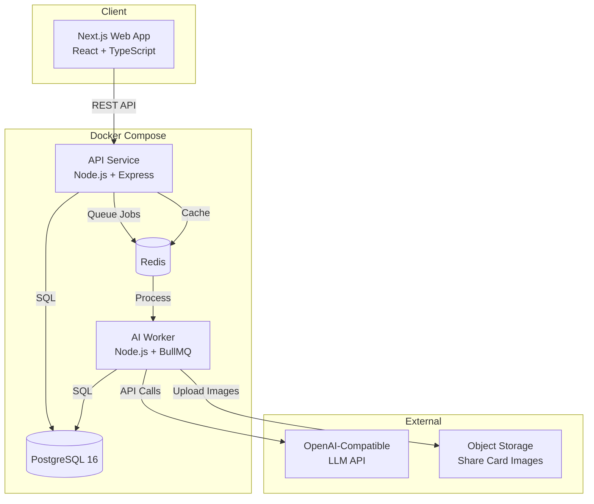
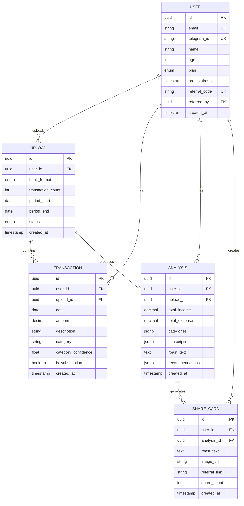

# Architecture: cleo-rf

**Date:** 2026-04-08

---

## Architecture Style

**Distributed Monolith in Monorepo** — three containerized services sharing code via packages, deployed with Docker Compose to a single VPS. See [ADR-002](adr/ADR-002-architecture-distributed-monolith.md).

## High-Level Diagram



## Monorepo Structure

```
cleo-rf/
├── apps/
│   ├── web/                    # Next.js frontend (SSR + client)
│   │   ├── app/                # App Router pages
│   │   │   ├── (auth)/         # Login, register
│   │   │   ├── dashboard/      # Main dashboard
│   │   │   ├── upload/         # CSV upload flow
│   │   │   ├── analysis/       # Results + roast
│   │   │   └── settings/       # User settings, Pro upgrade
│   │   ├── components/         # UI components
│   │   │   ├── chat/           # Chat-style roast display
│   │   │   ├── charts/         # Recharts spending charts
│   │   │   ├── upload/         # CSV upload dropzone
│   │   │   └── share/          # Share card preview
│   │   └── lib/                # Client utilities
│   │
│   ├── api/                    # Express API server
│   │   ├── routes/             # API routes
│   │   │   ├── auth.ts         # Auth endpoints
│   │   │   ├── upload.ts       # CSV upload
│   │   │   ├── analysis.ts     # Analysis results
│   │   │   ├── roast.ts        # Roast generation
│   │   │   ├── share.ts        # Share card
│   │   │   └── subscription.ts # Pro management
│   │   ├── middleware/         # Auth, rate-limit, error handling
│   │   ├── services/           # Business logic
│   │   │   ├── csv-parser.ts   # Multi-format CSV parser
│   │   │   ├── categorizer.ts  # AI transaction categorization
│   │   │   └── subscription-detector.ts
│   │   └── queue/              # BullMQ job definitions
│   │
│   └── ai-worker/              # Background AI processing
│       ├── processors/         # Job processors
│       │   ├── analyze.ts      # Full analysis pipeline
│       │   ├── roast.ts        # Roast generation
│       │   ├── categorize.ts   # Batch categorization
│       │   └── share-card.ts   # Image generation
│       └── prompts/            # System prompts
│           ├── roast.ts        # Roast Mode prompt
│           ├── hype.ts         # Hype Mode prompt
│           ├── categorize.ts   # Category assignment
│           └── recommend.ts    # Savings recommendations
│
├── packages/
│   ├── shared/                 # Shared types, constants, utils
│   │   ├── types/              # TypeScript types (User, Transaction, etc.)
│   │   ├── constants/          # Categories, bank formats
│   │   └── utils/              # Date parsing, number formatting
│   │
│   ├── db/                     # Database layer
│   │   ├── schema/             # Drizzle ORM schema
│   │   ├── migrations/         # SQL migrations
│   │   └── seed/               # Test data seeding
│   │
│   └── ai/                     # AI client wrapper
│       ├── client.ts           # OpenAI-compatible client (configurable)
│       ├── prompts/            # Prompt templates
│       └── guardrails.ts       # Content safety checks
│
├── docker-compose.yml
├── docker-compose.prod.yml
├── Dockerfile.api
├── Dockerfile.web
├── Dockerfile.worker
├── .env.example
└── turbo.json                  # Turborepo config
```

## Technology Stack

| Layer | Technology | Rationale |
|-------|-----------|-----------|
| **Frontend** | Next.js 15 (App Router) | SSR for SEO, React ecosystem, Vercel-compatible |
| **UI Components** | Tailwind CSS + shadcn/ui | Rapid development, consistent design |
| **Charts** | Recharts | Lightweight, React-native, pie/bar charts |
| **API** | Express.js + TypeScript | Lightweight, well-known, easy to extend |
| **Queue** | BullMQ + Redis | Reliable job processing for AI calls |
| **Database** | PostgreSQL 16 | ACID, JSON support, pgvector ready |
| **ORM** | Drizzle ORM | Type-safe, lightweight, migrations |
| **AI Client** | OpenAI SDK (configurable base_url) | Swap models freely |
| **Auth** | JWT + bcrypt | Stateless, simple |
| **Image Gen** | @vercel/og (Satori) | Server-side share card rendering |
| **Monorepo** | Turborepo | Fast builds, task caching |
| **Container** | Docker + Docker Compose | Consistent environments |
| **Reverse Proxy** | Nginx (or Traefik) | SSL termination, routing |

## Data Architecture

### Database Schema (ERD)



### Indexes

```sql
CREATE INDEX idx_transactions_user_date ON transactions(user_id, date DESC);
CREATE INDEX idx_transactions_upload ON transactions(upload_id);
CREATE INDEX idx_transactions_category ON transactions(user_id, category);
CREATE INDEX idx_uploads_user ON uploads(user_id, created_at DESC);
CREATE INDEX idx_analysis_upload ON analyses(upload_id);
```

## Security Architecture

### Authentication Flow
```
1. Register: email+password → bcrypt hash → JWT issued
2. Login: email+password → verify hash → JWT issued
3. Telegram: init_data → HMAC verification → JWT issued
4. All API calls: Bearer JWT in Authorization header
5. JWT expiry: 7 days, refresh on activity
```

### Data Security
- **At rest:** PostgreSQL with encrypted volumes
- **In transit:** TLS 1.3 via Nginx
- **CSV processing:** Parse in memory, store structured data only, delete raw file
- **Share cards:** Financial amounts never exposed (blurred/replaced)
- **Secrets:** .env file, never committed, Docker secrets in production

### Rate Limiting
| Endpoint | Free | Pro |
|----------|:----:|:---:|
| POST /upload | 5/day | 20/day |
| POST /roast | 1/day | unlimited |
| POST /share | 5/day | 20/day |
| GET /analysis | 100/hr | 500/hr |

## Scalability Considerations

### MVP (single VPS)
- 1 web container, 1 API container, 1 worker container
- PostgreSQL + Redis on same host
- Sufficient for ~1000 concurrent users

### v1 Scale-Up
- Add worker replicas (2-3) for AI processing
- PgBouncer for connection pooling
- Redis Sentinel for queue reliability
- CDN for static assets + share card images

### v2 Scale-Out
- Move PostgreSQL to managed service
- Add read replicas for dashboard queries
- Separate AI worker to GPU-equipped host (if self-hosting models)
- Consider Kubernetes if >10 services

## Infrastructure

```
VPS (AdminVPS/HOSTKEY)
├── Nginx (reverse proxy, SSL via Let's Encrypt)
├── Docker Compose
│   ├── web (Next.js, port 3000)
│   ├── api (Express, port 4000)
│   ├── worker (BullMQ processor)
│   ├── postgres (port 5432)
│   ├── redis (port 6379)
│   └── pgbouncer (port 6432, v1+)
├── Volumes
│   ├── pgdata (PostgreSQL data)
│   ├── redis-data (queue persistence)
│   └── uploads (temporary CSV storage)
└── Cron
    ├── pg_dump daily backup
    └── Log rotation
```
